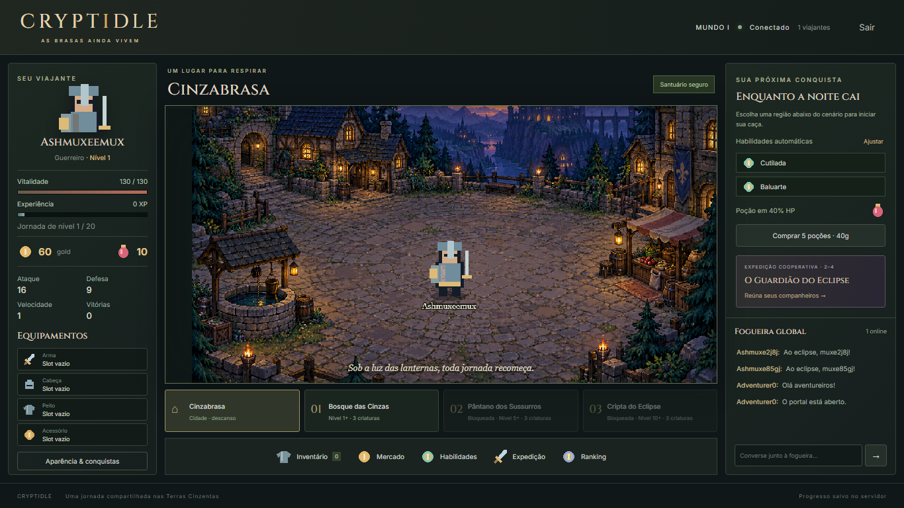
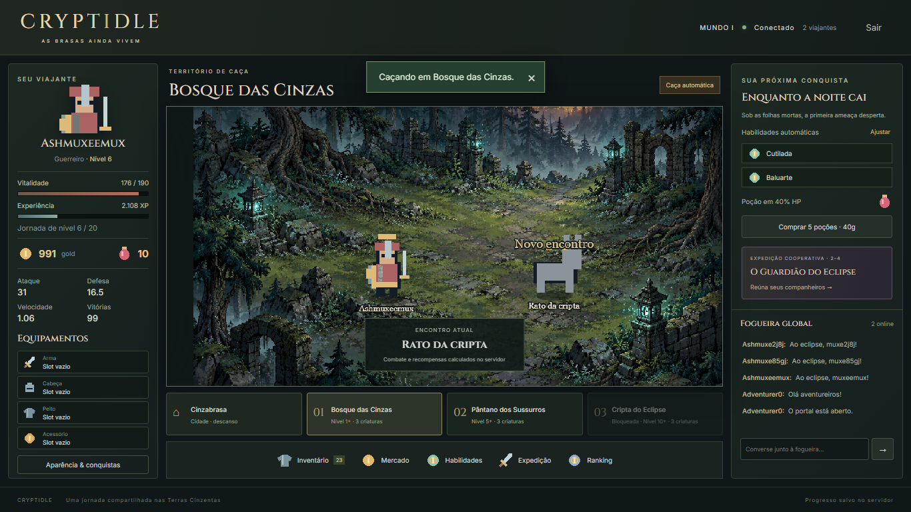

# Cryptidle

**As brasas ainda vivem.**

RPG idle multiplayer de fantasia medieval sombria, feito para jogar com amigos. Escolha sua classe, explore os arredores de Cinzabrasa, encontre equipamentos e reúna um grupo para enfrentar o Guardião do Eclipse.

**Escolha uma região → cace automaticamente → ganhe XP, gold e drops → melhore sua build → enfrente novos desafios.**

Projeto pessoal que une desenvolvimento de jogos, sistemas multiplayer e estudo de infraestrutura AWS.



> **Em desenvolvimento:** o núcleo do MVP está implementado. Arte, animações e experiência de combate seguem em evolução. A infraestrutura AWS está definida em código; o deploy não está confirmado na documentação atual.

## O jogo

| Sistema | O que você encontra |
| --- | --- |
| Classes | Guerreiro, Mago e Sacerdote, com habilidades e atributos próprios |
| Exploração | Cidade de Cinzabrasa, três regiões de caça e nove monstros |
| Progressão | Níveis 1–20, gold, XP e até oito horas de progresso offline |
| Equipamentos | 24 definições de equipamentos, raridades, inventário e slots |
| Aparência | Skins desbloqueáveis por conquista |
| Economia | Mercado entre jogadores, anúncios por preço fixo e venda para NPC |
| Cooperação | Expedição automática para grupos de dois a quatro jogadores |
| Social | Presença na cidade, chat global e ranking |

Combate, recompensas e transações são calculados no servidor. O PostgreSQL persiste o progresso; o navegador apresenta o mundo e envia ações.

## Veja o MVP



As capturas versionadas registram etapas do desenvolvimento e podem diferir da versão atual.

[Inventário](docs/evidence/inventory-1366.png) · [Expedição](docs/evidence/boss-1366.png) · [Interface móvel](docs/evidence/mobile-390.png) · [Prévia de animações](docs/evidence/animation-preview-1366x768.png)

## Stack

| Camada | Tecnologias |
| --- | --- |
| Interface e mundo | React, Vite, Phaser e TypeScript |
| Servidor | Node.js, Fastify e WebSocket |
| Autenticação | Better Auth, com sessão por cookie |
| Banco de dados | PostgreSQL e Prisma |
| Monorepo | pnpm workspaces |
| Testes | Vitest e Playwright |
| Infraestrutura | Docker Compose e AWS CDK em TypeScript |
| Automação | GitHub Actions; workflow de deploy com AWS OIDC |

## Rodar localmente

### Requisitos

- Node.js **24.x**.
- pnpm **10.24.0**, conforme `packageManager`.
- PostgreSQL **17**, com usuário e banco locais.
- Git; GitHub CLI é opcional.
- Python e Pillow somente para trabalhar nos geradores/validadores de sprites.

### 1. Clonar e instalar

```sh
gh repo clone mrlptrc/cryptidle
cd cryptidle
pnpm install --frozen-lockfile
```

Sem GitHub CLI, use `git clone https://github.com/mrlptrc/cryptidle.git`.

### 2. Configurar o servidor

Copie o exemplo de ambiente.

**PowerShell:**

```powershell
Copy-Item apps/server/development.env.example apps/server/.env
```

**Bash:**

```sh
cp apps/server/development.env.example apps/server/.env
```

Crie o banco `cryptidle` no PostgreSQL e ajuste `apps/server/.env`:

| Variável | Configuração local |
| --- | --- |
| `DATABASE_URL` | URL do seu PostgreSQL, com usuário, senha e banco |
| `BETTER_AUTH_SECRET` | Segredo aleatório com pelo menos 32 caracteres |
| `APP_ORIGIN` | `http://localhost:5173` |
| `NODE_ENV` | `development` |

Gere um segredo local:

```sh
node -e "console.log(require('node:crypto').randomBytes(32).toString('base64url'))"
```

Copie o resultado para `BETTER_AUTH_SECRET`. Não versione arquivos `.env`.

### 3. Aplicar migrations e iniciar

```sh
pnpm db:generate
pnpm db:migrate
pnpm dev
```

Abra **http://localhost:5173**, crie uma conta e escolha sua classe. A API utiliza a porta **3000**.

Para diagnóstico e configurações adicionais, consulte [desenvolvimento local](docs/LOCAL_DEVELOPMENT.md).

### Alternativa: Docker Compose

Requer Docker Engine ativo e Docker Compose. Copie `.env.example` para `.env` na raiz e substitua `POSTGRES_PASSWORD` e `BETTER_AUTH_SECRET` por valores aleatórios diferentes e seguros para URL. Mantenha `APP_ORIGIN=http://localhost:3000`.

```sh
docker compose --env-file .env -f docker-compose.yml -f compose.development.yml up --build
```

Abra **http://localhost:3000**. As migrations são aplicadas antes da aplicação iniciar. O override de desenvolvimento expõe o PostgreSQL apenas em `127.0.0.1:5432`; essa porta precisa estar livre.

Os dados ficam no volume `cryptidle-database`. Não use `down -v` se deseja preservá-los. A execução completa do Compose ainda consta como pendente no [checklist do MVP](docs/MVP_CHECKLIST.md).

## Comandos úteis

| Comando | Finalidade |
| --- | --- |
| `pnpm dev` | Iniciar API e frontend em desenvolvimento |
| `pnpm build` | Compilar os pacotes |
| `pnpm lint` | Verificar o código |
| `pnpm typecheck` | Verificar tipos |
| `pnpm test` | Executar testes do núcleo do jogo |
| `pnpm test:integration` | Executar testes com PostgreSQL |
| `pnpm test:e2e` | Executar jornada de navegador |
| `pnpm simulate` | Simular progressão e atualizar evidências de balanceamento |
| `pnpm validate:assets` | Validar spritesheets com Python/Pillow |
| `pnpm --filter @cryptidle/infra test` | Verificar invariantes da infraestrutura |
| `pnpm infra:synth` | Gerar CloudFormation sem provisionar recursos |

**Testes de integração e E2E usam banco descartável:** configure `DATABASE_URL` para um banco cujo nome termine em `_test`, como `cryptidle_test`. Os testes podem limpar ou modificar dados. Nunca use o banco dos jogadores. Antes do primeiro E2E, instale o navegador com `pnpm exec playwright install chromium`.

As evidências registradas estão no [checklist do MVP](docs/MVP_CHECKLIST.md) e no [checklist da rodada visual](docs/VISUAL_ROUND_CHECKLIST.md). Esses registros não substituem uma nova execução dos testes na sua revisão.

## Organização do projeto

| Caminho | Responsabilidade |
| --- | --- |
| `apps/web` | Interface, cenas Phaser e assets públicos |
| `apps/server` | API, autenticação, persistência e migrations |
| `packages/game-core` | Regras, conteúdo e simulação do jogo |
| `packages/shared` | Tipos e contratos compartilhados |
| `assets` | Fontes, geradores, manifesto e validação de arte |
| `infra` | AWS CDK, proxy e configuração operacional |
| `scripts` | Deploy, backup, restauração e simulação |
| `tests/e2e` | Jornada integrada no navegador |
| `docs` | Decisões, guias e evidências |

## Arte e animação

A direção visual combina fantasia sombria, personagens estilizados e cenários detalhados. A evolução dos sprites busca proporções inspiradas em RPGs clássicos como Ragnarok, com identidade própria para o Cryptidle.

A substituição dos modelos provisórios é gradual. O Guerreiro e o Morcego têm uma primeira implementação de folhas de animação; acabamento, continuidade dos quadros e validação na caça ainda têm pendências documentadas.

Em desenvolvimento, a prévia está em **http://localhost:5173/dev/animations**. Ela permite selecionar ator, ação e direção, pausar e avançar quadros.

Consulte o [guia de arte](docs/ART_GUIDE.md), o [manifesto](assets/manifest.json) e a [auditoria visual](docs/VISUAL_ROUND_AUDIT.md).

## AWS e operação

A infraestrutura como código descreve uma implantação pequena para jogar com amigos:

- EC2 com aplicação e PostgreSQL em Docker Compose.
- ECR para imagens, S3 para backups e CloudWatch para logs.
- SSM para administração e configuração de segredos.
- Caddy para HTTPS e proxy de API/WebSocket.
- GitHub Actions com OIDC para deploy autorizado.

Aplicação e banco na mesma instância são uma escolha de simplicidade para o MVP, com ponto único de falha. Não há alta disponibilidade.

**Síntese CDK não é deploy.** O provisionamento depende de conta, domínio, configuração e autorização do proprietário. Veja [implantação AWS](docs/AWS_DEPLOY.md) para os passos e premissas de custo, e [operações](docs/OPERATIONS.md) para backup, restauração e rollback.

## Próximas entregas

- Refinar e integrar spritesheets consistentes de Guerreiro e Morcego.
- Expandir a direção artística para classes, skins e demais monstros.
- Melhorar leitura do combate, ambientação e acabamento da interface.
- Concluir as verificações visuais e operacionais pendentes.
- Validar o ambiente compartilhado na AWS após provisionamento autorizado.

Consulte o [roadmap](docs/ROADMAP.md) para a evolução planejada.

## Documentação

| Tema | Guia |
| --- | --- |
| Mecânicas e progressão | [Game design](docs/GAME_DESIGN.md) |
| Componentes e fluxos | [Arquitetura](docs/ARCHITECTURE.md) |
| Setup e diagnóstico | [Desenvolvimento local](docs/LOCAL_DEVELOPMENT.md) |
| Acesso e integridade | [Segurança](docs/SECURITY.md) |
| Estado e evidências | [Checklist do MVP](docs/MVP_CHECKLIST.md) |
| Pendências de arte | [Checklist visual](docs/VISUAL_ROUND_CHECKLIST.md) |

## Limitações e licença

O jogo usa economia fictícia. Ainda não inclui recuperação de senha por e-mail, pets, troca direta, leilões, PvP ou temporadas. O chat é global e simples; a presença online é reconstruída após reinício do servidor.

A licença definitiva do projeto ainda não foi definida pelo proprietário. Consulte [licenças de terceiros](docs/THIRD_PARTY_LICENSES.md) e o [manifesto de assets](assets/manifest.json) para a procedência dos componentes e artes.
