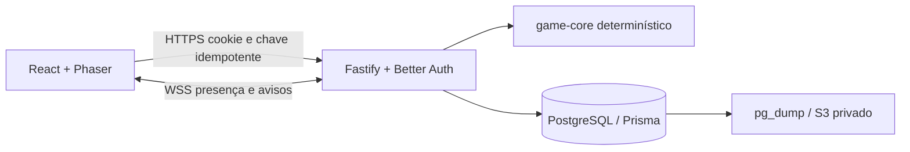

# Arquitetura

Monólito modular TypeScript, PostgreSQL como fonte de verdade. React organiza painéis e janelas, Phaser representa o mundo. HTTP com sessão por cookie executa comandos e consultas; WebSocket transmite presença/chat e avisos para reconsultar estado. Nenhum resultado de combate, loot ou tempo enviado pelo cliente é aceito.

## Módulos

- `packages/shared`: contratos públicos de estado, conteúdo, itens, salas e mensagens.
- `packages/game-core`: conteúdo, progressão, atributos, encontros e boss como funções puras.
- `apps/server`: autenticação, validação, autorização, transações, persistência, transporte e presença.
- `apps/web`: interface, imagens locais e animação; nunca concede valor.
- `infra`: CDK e arquivos de operação. Um host privado pequeno, sem Kubernetes ou microsserviços.

## Persistência e concorrência

Better Auth gerencia usuário, sessão, conta e verificação. Um personagem por usuário, com estado de domínio JSON e colunas de nível/XP/gold para índices e constraints. Equipamentos/anúncios e recibos são relacionais. IDs únicos, FK e CHECK reforçam invariantes. Migrations versionadas em `apps/server/prisma/migrations`.

Todas as mutações e liquidações usam transações PostgreSQL e advisory lock global curto. Esta escolha serializa a economia inteira e simplifica compras/cancelamentos concorrentes para um MVP privado. Funciona entre processos que usam o mesmo banco, inclusive depois de reinício. Limitação explícita: throughput não escala a milhares de jogadores. Evolução futura: locks por personagem/item em ordem estável; manter os mesmos testes concorrentes.

Chave idempotente UUID obrigatória por mutação, escopo usuário, hash de rota+payload e resposta persistida na mesma transação. Repetição retorna a resposta anterior; mesma chave com payload diferente falha. Falha antes do commit reverte item, gold, anúncio e recibo juntos. Clientes devem preservar chave em retries de rede. Recibos não são descartados automaticamente no MVP para preservar essa garantia.

Cada leitura de estado liquida caça, usando horário do servidor. Uma segunda aba vê o intervalo já liquidado. Troca de build/região liquida antes e descarta o encontro parcial. Boss persiste snapshots e fim; conclusão é lazy em qualquer leitura relevante. Sem cron/memória obrigatória para completar caça ou expedição. Sem atividade externa, a conclusão materializa no próximo acesso, respeitando o horário persistido.

Presença é efêmera e pode desaparecer no reinício; clientes reconectam. Chat mantém somente 100 mensagens no banco. O sinal WebSocket `refresh` é sugestão para leitura autenticada. Estado compartilhado confiável vem do banco.

## Dependências e compatibilidade

Node 24 LTS; pnpm 10.24; TypeScript 5.9; React 19; Vite 7; Phaser 3.90; Fastify 5; Better Auth 1.7.7; Prisma 6.19; PostgreSQL 17; AWS CDK v2. Versões exatas em manifests/lockfile. Phaser 3 foi selecionado pela API estável e ampla documentação; Prisma 6 evita migração de configuração v7/8 durante o MVP.

Fontes oficiais consultadas em 2026-10-06:

- [Vite: requisitos Node](https://vite.dev/guide/): Node 20.19+ ou 22.12+.
- [Fastify LTS](https://fastify.dev/docs/latest/Reference/LTS/).
- [Prisma requisitos](https://www.prisma.io/docs/orm/reference/system-requirements) e metadados oficiais npm de `prisma@6.19.0` (Node >=18.18).
- [Better Auth instalação](https://better-auth.com/docs/installation): adaptadores e senha/sessão mantidos pela biblioteca.
- [Phaser instalação](https://docs.phaser.io/phaser/getting-started/installation): TypeScript e npm suportados.
- [CDK suporte Node](https://docs.aws.amazon.com/cdk/v2/guide/node-versions.html).

A página pública [PokeIdle](https://pokeidle.io/app) foi consultada para organização geral (mundo, automação e janelas). Não foram copiados assets, código ou textos; não houve acesso a sessão autenticada, prints ou vídeos externos.
